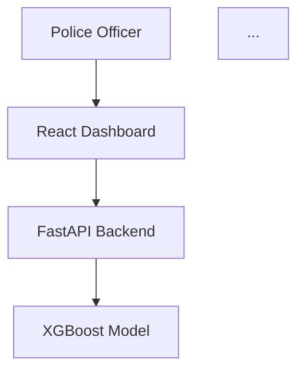

# 🎨 Claude AI Visual Diagram Prompts

## 📋 Table of Contents
1. [Mermaid Architecture Diagrams](#mermaid-architecture-diagrams)
2. [ASCII Art System Diagrams](#ascii-art-system-diagrams)
3. [Flowchart & Process Diagrams](#flowchart--process-diagrams)
4. [Database Visual Schemas](#database-visual-schemas)
5. [Network & Integration Diagrams](#network--integration-diagrams)
6. [UI/UX Wireframe Diagrams](#uiux-wireframe-diagrams)
7. [Security Architecture Visuals](#security-architecture-visuals)
8. [Data Flow Visual Maps](#data-flow-visual-maps)
9. [Deployment Architecture Diagrams](#deployment-architecture-diagrams)
10. [Performance Monitoring Dashboards](#performance-monitoring-dashboards)

---

## � Mermaid Architecture Diagrams

### **Complete System Architecture Mermaid**
```
Create a comprehensive Mermaid diagram showing the Police Financial Crime Investigation System architecture. 

OUTPUT: Generate ONLY the Mermaid diagram code - no explanatory text.

SYSTEM TO VISUALIZE:
- React Frontend (Police Dashboard) on port 3000
- FastAPI Backend with ML engine on port 8001  
- XGBoost fraud detection model (99.96% AUC)
- Banking API integrations (SBI, HDFC, ICICI, Axis, PNB)
- Advanced analytics engine with 5 modules
- Real-time monitoring and alert systems

DIAGRAM REQUIREMENTS:
- Use flowchart format with proper node shapes
- Color-code different system layers
- Show data flow with labeled arrows
- Include external integrations
- Mark security boundaries
- Show real-time data paths

FORMAT: Provide the complete Mermaid flowchart diagram code ready to paste into any Mermaid renderer.
```

### **Banking Integration Flow Mermaid**
```
Generate a Mermaid sequence diagram showing real-time banking integration for fraud detection.

OUTPUT: Provide ONLY the Mermaid sequence diagram code.

SEQUENCE TO SHOW:
1. Police system authentication with banking APIs
2. Real-time transaction data streaming
3. AI fraud detection processing
4. Alert generation and notification workflow
5. Investigation initiation process

BANKS: SBI, HDFC, ICICI, Axis Bank, PNB

REQUIREMENTS:
- Show authentication flows (OAuth 2.0, API keys)
- Display real-time data streaming
- Include error handling sequences
- Show parallel processing for multiple banks
- Mark critical timing points

FORMAT: Complete Mermaid sequenceDiagram code ready for rendering.
```

### **Police Investigation Workflow Mermaid**
```
Create a Mermaid flowchart showing the complete police investigation process using the AI system.

OUTPUT: Generate ONLY the Mermaid flowchart code.

WORKFLOW STAGES:
1. Case initiation → Data collection → AI analysis → Investigation → Resolution
2. Include decision points, parallel processes, and error handling
3. Show integration points with the AI system
4. Mark approval and escalation flows

VISUAL ELEMENTS:
- Use diamond shapes for decisions
- Rectangle shapes for processes
- Different colors for officer vs system actions
- Show timing and SLA requirements
- Include feedback loops and iterations

FORMAT: Complete Mermaid flowchart code with proper syntax and styling.
```

---

## 🎭 ASCII Art System Diagrams

### **System Architecture ASCII Visual**
```
Create a detailed ASCII art diagram of the complete system architecture.

OUTPUT: Generate ONLY the ASCII art diagram - no explanatory text.

COMPONENTS TO VISUALIZE:
- Frontend: React Police Dashboard (Port 3000)
- Backend: FastAPI with ML Engine (Port 8001)
- ML Model: XGBoost Classifier (99.96% AUC)
- Banking APIs: SBI, HDFC, ICICI, Axis, PNB
- Analytics Engine: 5 specialized modules
- Real-time data flows and connections

ASCII REQUIREMENTS:
- Use box drawing characters: ┌─┐ │ │ └─┘ ├─┤ ┬─┴ ┼
- Show arrows for data flow: ──>, <──, ↕, ↔, ⇅, ⇄
- Include system boundaries and security zones
- Mark ports, protocols, and connection types
- Show load balancing and scaling points

FORMAT: Complete ASCII diagram ready for documentation.
```

### **Data Flow Pipeline ASCII Map**
```
Generate an ASCII art data flow diagram showing transaction processing pipeline.

OUTPUT: Provide ONLY the ASCII art diagram.

DATA FLOWS:
1. Real-time banking data → Processing → AI analysis → Alerts
2. Batch CSV uploads → Validation → ML inference → Reports  
3. Investigation workflow → Evidence collection → Case resolution

VISUAL ELEMENTS:
- Data sources: {{Source}}
- Processing stages: [Process]
- Storage: [=====]
- Queues: <Queue>
- External systems: ((External))
- Flows: ===>, <===, |||, ▼, ▲

FORMAT: Complete ASCII data flow map with proper alignment and spacing.
```

### **Network Topology ASCII Diagram**
```
Create an ASCII network diagram showing system deployment and connections.

OUTPUT: Generate ONLY the ASCII network diagram.

NETWORK ELEMENTS:
- Police workstations and mobile devices
- Load balancers and reverse proxies
- Application servers and databases
- Banking API endpoints
- Security firewalls and VPNs
- Monitoring and logging systems

REQUIREMENTS:
- Show network segments and VLANs
- Include IP ranges and protocols
- Mark security boundaries and access controls
- Display redundancy and failover paths
- Show monitoring and alert flows

FORMAT: Complete ASCII network topology diagram.
```

---

## 📊 Flowchart & Process Diagrams

### **Investigation Process Flowchart**
```
Create a visual flowchart showing the police investigation workflow from complaint to resolution.

OUTPUT: Generate a Mermaid flowchart diagram code ONLY.

PROCESS FLOW:
1. Complaint received → Case creation → Priority assignment
2. Data gathering → AI analysis → Pattern detection
3. Evidence collection → Suspect identification → Asset investigation
4. Legal action → Court proceedings → Case closure

VISUAL REQUIREMENTS:
- Decision diamonds with Yes/No branches
- Process rectangles with clear labels
- Start/end ovals for workflow boundaries
- Different colors for different phases
- Time estimates for each stage
- Escalation and approval points

FORMAT: Complete Mermaid flowchart with proper node types and connections.
```

### **Fraud Detection Decision Tree**
```
Generate a visual decision tree showing how the AI system classifies transactions.

OUTPUT: Provide Mermaid flowchart diagram code ONLY.

DECISION CRITERIA:
- Transaction amount thresholds
- Time-based patterns (unusual hours, frequency)
- Location-based anomalies
- Merchant category analysis
- Historical behavior patterns
- Risk scoring algorithms

VISUAL ELEMENTS:
- Decision nodes with criteria
- Probability scores at each branch
- Final classification outcomes
- Confidence levels and thresholds
- Feature importance indicators

FORMAT: Complete Mermaid decision tree flowchart.
```

---

## 🗄️ Database Visual Schemas

### **Data Model Entity Relationship Diagram**
```
Create a visual ER diagram showing the complete data model for the fraud detection system.

OUTPUT: Generate Mermaid ER diagram code ONLY.

ENTITIES TO SHOW:
- Investigation Cases (case_id, officer, priority, status)
- Transaction Records (txn_id, amount, timestamp, risk_score)  
- Banking Connections (bank_code, api_status, rate_limits)
- Analysis Results (analysis_id, results, confidence)
- Alert Records (alert_id, severity, timestamp, status)
- Audit Logs (log_id, user_action, timestamp)

RELATIONSHIPS:
- One-to-many: Cases → Transactions
- Many-to-many: Officers → Cases
- One-to-many: Banks → Connections
- One-to-many: Transactions → Alerts

FORMAT: Complete Mermaid ER diagram with entities, attributes, and relationships.
```

### **File Storage Architecture Diagram**
```
Generate a visual diagram showing file storage and data organization.

OUTPUT: Provide ASCII art diagram ONLY.

STORAGE STRUCTURE:
- ML model artifacts (PKL files, encoders)
- Training datasets (CSV, processed data)
- Investigation files (uploads, reports)
- Configuration files (API keys, settings)
- Log files (audit trails, error logs)

VISUAL ELEMENTS:
- Folder hierarchies with tree structure
- File types and sizes
- Access permissions and security
- Backup and versioning
- Storage locations and paths

FORMAT: Complete ASCII directory tree with file details.
```

---

## 🌐 Network & Integration Diagrams

### **Banking API Integration Architecture**
```
Create a network diagram showing banking API integrations and security layers.

OUTPUT: Generate Mermaid network diagram code ONLY.

INTEGRATION LAYERS:
- API Gateway with rate limiting
- Authentication layer (OAuth 2.0, JWT)
- Banking API endpoints (SBI, HDFC, ICICI, Axis, PNB)
- Data transformation and validation
- Real-time streaming and alerts

SECURITY ELEMENTS:
- SSL/TLS encryption
- API key management
- Certificate authentication
- Network firewalls
- Intrusion detection

FORMAT: Complete Mermaid network diagram with security zones.
```

### **Real-time Data Pipeline Visualization**
```
Generate a visual data pipeline showing real-time transaction processing.

OUTPUT: Provide Mermaid flowchart diagram code ONLY.

PIPELINE STAGES:
1. Data ingestion from banking APIs
2. Stream processing and validation
3. Feature engineering and transformation
4. ML model inference and scoring
5. Alert generation and routing
6. Investigation workflow triggering

VISUAL REQUIREMENTS:
- Show parallel processing streams
- Include buffering and queuing
- Mark processing times and throughput
- Display error handling and recovery
- Show monitoring and metrics collection

FORMAT: Complete Mermaid data pipeline flowchart.
```

---

## 🎨 UI/UX Wireframe Diagrams

### **Police Dashboard Wireframe**
```
Create ASCII wireframe mockups of the police investigation dashboard.

OUTPUT: Generate ASCII wireframe diagrams ONLY.

DASHBOARD SCREENS:
1. Main Dashboard - alerts, case summary, system status
2. File Upload - drag-drop area, progress, validation
3. Analysis Results - fraud scores, risk factors, recommendations
4. Banking Monitor - live feeds, alerts, bank status
5. Investigation Workspace - case files, evidence, reports

WIREFRAME ELEMENTS:
- Use ASCII boxes for UI components: ┌─────┐ │ Text │ └─────┘
- Show navigation menus and buttons
- Include data tables and charts
- Mark interactive elements
- Display responsive layouts

FORMAT: Complete ASCII wireframes for each screen.
```

### **Mobile Investigation App Layout**
```
Generate ASCII wireframes for mobile police investigation interface.

OUTPUT: Provide ASCII mobile wireframes ONLY.

MOBILE SCREENS:
- Login screen with badge authentication
- Quick transaction lookup
- Alert notifications and responses
- Photo evidence capture
- Report generation and sharing

MOBILE ELEMENTS:
- Touch-friendly button layouts
- Swipe gestures and interactions
- Camera integration points
- GPS location features
- Offline capability indicators

FORMAT: Complete ASCII mobile wireframes with annotations.
```

---

## 🔐 Security Architecture Visuals

### **Security Layers Diagram**
```
Create a visual security architecture showing all protection layers.

OUTPUT: Generate Mermaid diagram code ONLY.

SECURITY LAYERS:
1. Network Security - firewalls, VPN, intrusion detection
2. Application Security - authentication, authorization, encryption
3. Data Security - encryption at rest/transit, masking, backup
4. API Security - rate limiting, key management, monitoring
5. Compliance - audit trails, data retention, privacy controls

VISUAL ELEMENTS:
- Layered security model
- Threat vectors and mitigations
- Security controls and policies
- Monitoring and incident response
- Compliance checkpoints

FORMAT: Complete Mermaid security architecture diagram.
```

### **Threat Model Visualization**
```
Generate a threat modeling diagram for the fraud detection system.

OUTPUT: Provide Mermaid threat model diagram ONLY.

THREAT ANALYSIS:
- Attack surfaces and entry points
- Threat actors and motivations
- Attack vectors and techniques
- Security controls and countermeasures
- Risk assessment and mitigation

VISUAL REPRESENTATION:
- Threat actor nodes
- Attack path flows
- Asset protection zones
- Control effectiveness ratings
- Risk heat mapping

FORMAT: Complete Mermaid threat model with color-coded risk levels.
```

---

## 📈 Data Flow Visual Maps

### **Transaction Processing Flow Map**
```
Create a visual map showing how transaction data flows through the entire system.

OUTPUT: Generate ASCII art flow diagram ONLY.

DATA FLOW STAGES:
1. Input Sources: Banking APIs, CSV uploads, manual entry
2. Validation: Data quality checks, format validation
3. Processing: Feature engineering, transformation
4. Analysis: ML inference, risk scoring, pattern detection
5. Output: Alerts, reports, investigation triggers

FLOW VISUALIZATION:
- Use arrows to show data movement: ──>, ═══>, ⟹
- Show data volumes and processing times
- Mark bottlenecks and optimization points
- Include error handling and recovery paths
- Display real-time vs batch processing

FORMAT: Complete ASCII data flow map with timing annotations.
```

### **Banking Data Integration Map**
```
Generate a visual map of banking data integration and real-time monitoring.

OUTPUT: Provide ASCII art integration diagram ONLY.

INTEGRATION POINTS:
- SBI API endpoints and data formats
- HDFC real-time streaming protocols
- ICICI batch processing schedules
- Axis Bank authentication flows
- PNB monitoring configurations

VISUAL ELEMENTS:
- Bank icons and connection status
- Data format transformations
- Authentication checkpoints
- Rate limiting and quotas
- Error handling and retries

FORMAT: Complete ASCII banking integration map.
```

---

## 🚀 Deployment Architecture Diagrams

### **Production Deployment Diagram**
```
Create a deployment architecture diagram for production environment.

OUTPUT: Generate Mermaid deployment diagram code ONLY.

DEPLOYMENT COMPONENTS:
- Load balancers and reverse proxies
- Application server clusters
- Database and storage systems
- Banking API gateways
- Monitoring and logging infrastructure
- Backup and disaster recovery

INFRASTRUCTURE ELEMENTS:
- Cloud providers and regions
- Container orchestration (Docker/Kubernetes)
- Auto-scaling configurations
- Health checks and monitoring
- Security scanning and compliance

FORMAT: Complete Mermaid deployment architecture diagram.
```

### **Development Environment Setup**
```
Generate a visual guide for setting up the development environment.

OUTPUT: Provide ASCII art setup diagram ONLY.

SETUP COMPONENTS:
- Local development tools and IDEs
- Python virtual environment configuration
- React development server setup
- Database and model file organization
- API testing and debugging tools

VISUAL WORKFLOW:
- Step-by-step setup process
- Dependencies and prerequisites
- Configuration file locations
- Testing and validation steps
- Troubleshooting common issues

FORMAT: Complete ASCII development setup diagram.
```

---

## 📊 Performance Monitoring Dashboards

### **System Performance Dashboard Layout**
```
Create a visual layout for the system performance monitoring dashboard.

OUTPUT: Generate ASCII dashboard wireframe ONLY.

DASHBOARD PANELS:
1. API Response Times - charts and graphs
2. ML Model Performance - accuracy metrics, inference times
3. Banking Integration Status - connection health, data rates
4. System Resource Usage - CPU, memory, disk, network
5. Alert and Notification Metrics - volumes, response times

VISUAL ELEMENTS:
- Real-time charts and gauges
- Status indicators and alerts
- Historical trend graphs
- Performance threshold markers
- System health summaries

FORMAT: Complete ASCII dashboard layout with labeled sections.
```

### **Investigation Analytics Visualization**
```
Generate visual charts showing investigation analytics and patterns.

OUTPUT: Provide ASCII chart diagrams ONLY.

ANALYTICS CHARTS:
1. Fraud Detection Accuracy - ROC curves, confusion matrix
2. Investigation Timeline - case duration, resolution rates
3. Geographic Patterns - location-based fraud clusters
4. Temporal Analysis - time-based fraud patterns
5. Banking Channel Analysis - fraud rates by bank/channel

CHART TYPES:
- Bar charts for categorical data
- Line graphs for time series
- Heat maps for geographic data
- Pie charts for distribution analysis
- Scatter plots for correlation analysis

FORMAT: Complete ASCII charts with data labels and legends.
```

---

## 🎯 Claude AI Visual Output Guidelines

### **How to Get Perfect Visual Outputs from Claude AI**

1. **🎨 Specify Output Type**: Always request "Generate ONLY the diagram code" or "Provide ONLY ASCII art"
2. **📋 Request Format**: Ask for specific formats - Mermaid, ASCII, wireframes, charts
3. **🔍 Focus on Visuals**: Emphasize visual elements over explanatory text
4. **📐 Include Dimensions**: Specify size requirements and layout constraints
5. **🎨 Use Color Coding**: Request color schemes and visual hierarchies
6. **📊 Add Data Elements**: Include real data points and metrics in diagrams

### **Best Visual Output Formats**
- **🌐 Mermaid Diagrams**: Perfect for flowcharts, sequences, and network diagrams
- **🎭 ASCII Art**: Excellent for system architecture and wireframes  
- **📊 Text Charts**: Great for data visualization and analytics
- **🗺️ Process Maps**: Ideal for workflows and decision trees
- **📱 Wireframes**: Perfect for UI layouts and user interfaces

### **Example Usage**
```
Copy any prompt → Paste in Claude AI → Get instant visual diagram → Use in documentation
```

---

These Claude AI prompts are specifically designed to generate **visual diagrams, charts, and images** rather than text documents. Each prompt focuses on creating immediate visual outputs that can be directly used in presentations, documentation, and technical specifications.

### **ML Model Pipeline LLD**
```
Design the low-level architecture for the XGBoost fraud detection pipeline:

PIPELINE COMPONENTS:
1. Data Preprocessing:
   - Input validation and sanitization
   - Feature engineering pipeline
   - Data transformation steps
   - Missing value handling

2. Model Inference:
   - Model loading and caching
   - Batch vs real-time processing
   - Feature scaling and encoding
   - Prediction generation

3. Result Processing:
   - Probability interpretation
   - Risk level calculation
   - Confidence scoring
   - Alert generation logic

4. Performance Optimization:
   - Model caching strategies
   - Batch processing optimization
   - Memory management
   - CPU/GPU utilization

TECHNICAL DETAILS:
- File structure and model artifacts
- Loading and initialization procedures
- Thread safety considerations
- Error handling and fallback mechanisms
- Performance metrics and monitoring
- Model versioning and updates

Please include:
- Class diagrams for model components
- Data flow through the pipeline
- Error handling strategies
- Performance benchmarks
- Scalability considerations
```

### **Banking Integration LLD**
```
Create detailed low-level design for the Indian banking API integration module:

INTEGRATION ARCHITECTURE:
1. Authentication Management:
   - OAuth 2.0 flow implementation
   - API key management
   - Certificate-based authentication
   - Token refresh mechanisms

2. API Communication:
   - HTTP client configuration
   - Request/response handling
   - Retry logic and exponential backoff
   - Connection pooling and management

3. Data Processing:
   - Real-time transaction parsing
   - Data format standardization
   - Error detection and correction
   - Fraud pattern recognition

4. Alert System:
   - Real-time monitoring setup
   - Threshold-based alerting
   - Multi-channel notifications
   - Alert escalation procedures

BANK-SPECIFIC IMPLEMENTATIONS:
- SBI API integration details
- HDFC authentication flow
- ICICI data format specifications
- Axis Bank error handling
- PNB real-time monitoring

Include:
- Class hierarchy and interfaces
- State management patterns
- Error handling matrices
- Performance optimization techniques
- Security implementation details
```

---

## 🎨 UI/UX Workflow Prompts

### **Police Dashboard UI Design**
```
Create comprehensive UI/UX design specifications for the police fraud investigation dashboard:

DASHBOARD COMPONENTS:
1. Header Section:
   - Police department branding
   - Officer identification and role
   - System status indicators
   - Quick action buttons

2. Main Dashboard:
   - Real-time alert panel
   - Active case summary
   - Investigation progress tracker
   - System health monitors

3. Investigation Workspace:
   - Case file management
   - Data upload interface
   - Analysis results display
   - Evidence collection tools

4. Monitoring Center:
   - Live transaction feeds
   - Banking system status
   - Fraud pattern alerts
   - Geographic activity map

UI/UX REQUIREMENTS:
- Police-themed color scheme (blues, badges, official styling)
- Intuitive workflow for non-technical officers
- Mobile-responsive design for field use
- Accessibility compliance (WCAG 2.1)
- High-contrast mode for 24/7 operations

Please provide:
- Wireframe layouts for all screens
- Component interaction flows
- User journey mapping
- Error state designs
- Loading and progress indicators
- Responsive breakpoint specifications
```

### **Investigation Workflow UI**
```
Design the complete user interface workflow for police fraud investigations:

WORKFLOW SCREENS:
1. Case Creation:
   - Complaint intake form
   - Initial case assessment
   - Priority level assignment
   - Resource allocation

2. Data Input:
   - CSV file upload with validation
   - Manual transaction entry
   - Banking data import
   - Evidence attachment system

3. Analysis Dashboard:
   - AI analysis progress display
   - Real-time results updates
   - Risk assessment visualization
   - Pattern detection highlights

4. Investigation Tools:
   - Suspect profile builder
   - Timeline visualization
   - Network analysis display
   - Evidence correlation matrix

5. Reporting System:
   - Investigation summary generation
   - Court-ready evidence compilation
   - Case closure documentation
   - Knowledge base updates

INTERACTION PATTERNS:
- Progressive disclosure of complex information
- Context-sensitive help and guidance
- Bulk operations for efficiency
- Undo/redo functionality
- Auto-save for data protection

Include detailed mockups and interaction specifications.
```

---

## 📊 Architecture Diagram Prompts

### **System Component Diagram**
```
Generate a detailed system architecture diagram showing all components and their interactions:

COMPONENT LAYERS:
1. Presentation Layer:
   - React Frontend (Port 3000)
   - Police Dashboard Interface
   - Mobile-responsive components
   - Real-time update mechanisms

2. Application Layer:
   - FastAPI Backend (Port 8001)
   - Authentication and authorization
   - Business logic processing
   - API gateway functionality

3. Service Layer:
   - ML Model Service (XGBoost)
   - Banking Integration Service
   - Analytics Engine Service
   - Alert and Notification Service

4. Data Layer:
   - Model artifacts (PKL files)
   - Transaction data streams
   - Configuration storage
   - Audit and logging data

5. External Integrations:
   - Banking APIs (SBI, HDFC, ICICI, Axis, PNB)
   - Authentication providers
   - Notification services
   - Monitoring systems

DIAGRAM REQUIREMENTS:
- Show data flow directions
- Indicate protocols (HTTP, WebSocket, API)
- Mark security boundaries
- Highlight failure points
- Include load balancing points
- Show caching layers

Use ASCII art or provide detailed descriptions for visual representation.
```

### **Data Flow Architecture**
```
Create comprehensive data flow diagrams for the fraud detection system:

PRIMARY DATA FLOWS:
1. Investigation Workflow:
   Police Input → Validation → AI Analysis → Results → Action

2. Real-time Monitoring:
   Banking APIs → Data Aggregation → Fraud Detection → Alerts → Police Dashboard

3. Batch Processing:
   CSV Upload → Data Processing → ML Inference → Risk Assessment → Investigation Report

4. Analytics Pipeline:
   Transaction Data → Feature Engineering → Pattern Analysis → Insights → Recommendations

DATA TRANSFORMATION STAGES:
- Raw transaction data ingestion
- Data cleaning and validation
- Feature engineering and encoding
- ML model preprocessing
- Prediction and scoring
- Risk assessment calculation
- Alert generation and routing
- Report compilation and delivery

INTEGRATION POINTS:
- Banking API data ingestion
- Real-time stream processing
- Batch job scheduling
- Alert notification delivery
- Evidence storage and retrieval

Please include:
- Data format specifications at each stage
- Processing time requirements
- Error handling and recovery paths
- Data quality checkpoints
- Performance monitoring points
```

---

## 🗃️ Database Design Prompts

### **Data Model Design**
```
Design the complete data model for the fraud detection system:

CORE ENTITIES:
1. Investigation Cases:
   - Case ID, officer assignment, priority level
   - Creation timestamp, status updates
   - Related transactions and evidence
   - Investigation notes and outcomes

2. Transaction Records:
   - Transaction ID, amount, timestamp
   - Payment method, merchant category
   - Customer information, device data
   - Fraud probability and risk scores

3. Banking Connections:
   - Bank codes, API configurations
   - Authentication credentials
   - Connection status and health
   - Rate limiting and quota tracking

4. Analysis Results:
   - Analysis type and parameters
   - Results data and visualizations
   - Confidence scores and recommendations
   - Historical trend comparisons

5. Alert Records:
   - Alert type, severity level, timestamp
   - Associated transactions and patterns
   - Officer assignments and responses
   - Resolution status and outcomes

6. Audit Logs:
   - User actions and system events
   - Data access and modifications
   - Security events and violations
   - Performance metrics and errors

DATA RELATIONSHIPS:
- One-to-many: Cases to Transactions
- Many-to-many: Officers to Cases
- One-to-many: Banks to Connections
- One-to-many: Transactions to Alerts

Please provide:
- Entity relationship diagrams
- Table schemas with constraints
- Index optimization strategies
- Data retention policies
- Backup and recovery procedures
```

### **File Storage Architecture**
```
Design the file storage and management system for ML models and data:

STORAGE COMPONENTS:
1. ML Model Artifacts:
   - XGBoost model files (PKL format)
   - Feature encoders and scalers
   - Model metadata and versioning
   - Performance benchmarks

2. Training Data:
   - Historical transaction datasets
   - Labeled fraud examples
   - Feature engineering pipelines
   - Data quality reports

3. Investigation Files:
   - Uploaded CSV files
   - Generated reports and evidence
   - Case documentation
   - Exported analysis results

4. System Configuration:
   - API keys and certificates
   - Banking connection settings
   - Alert thresholds and rules
   - User permissions and roles

STORAGE REQUIREMENTS:
- High availability and durability
- Encryption at rest and in transit
- Version control and rollback
- Automated backup procedures
- Access control and auditing

Include storage architecture diagrams and access patterns.
```

---

## 📋 API Documentation Prompts

### **OpenAPI Specification**
```
Please generate a comprehensive OpenAPI (Swagger) specification document for the Police Financial Crime Investigation System API.

SYSTEM CONTEXT:
- FastAPI backend with fraud detection capabilities
- Police-focused endpoints for investigation workflows
- Banking integration APIs for real-time monitoring
- ML model inference endpoints for fraud analysis

API DOCUMENTATION REQUIREMENTS:
1. Complete OpenAPI 3.0 specification in YAML format
2. Detailed endpoint descriptions with use cases
3. Comprehensive request/response schemas
4. Authentication and security definitions
5. Example requests and responses
6. Error response documentation
7. Rate limiting and usage guidelines

ENDPOINTS TO DOCUMENT:
- Authentication: /login, /logout, /refresh
- Fraud Detection: /predict, /batch-analyze
- File Operations: /upload, /download-report
- Banking Integration: /banking/status, /banking/transactions
- Analytics: /analytics/comprehensive, /analytics/patterns
- Investigation: /cases, /evidence, /reports

Please include:
1. API metadata (title, description, version, contact)
2. Server configurations and base URLs
3. Security schemes (JWT, API keys)
4. Data models with validation rules
5. Response codes and error handling
6. Usage examples and code samples

Format as a complete OpenAPI specification that can be imported into Swagger UI or Postman for API testing and documentation.

Example structure:
```yaml
openapi: 3.0.0
info:
  title: Police Fraud Detection API
  description: AI-powered fraud detection system for police investigations
  version: 1.0.0
paths:
  /predict:
    post:
      summary: Analyze transaction for fraud
      # detailed specification
```

Make it production-ready and comprehensive for developer integration.
```

### **SDK and Integration Guide**
```
Create developer integration guides and SDK documentation:

INTEGRATION COMPONENTS:
1. Python SDK:
   - Client library installation
   - Authentication setup
   - Method implementations
   - Error handling examples

2. JavaScript/React Integration:
   - Frontend integration patterns
   - API call implementations
   - State management strategies
   - Error boundary handling

3. Webhook Integration:
   - Alert notification setup
   - Payload specifications
   - Security validation
   - Retry mechanisms

4. Banking API Integration:
   - Bank-specific authentication
   - Data format conversions
   - Error handling strategies
   - Rate limiting compliance

EXAMPLES AND TUTORIALS:
- Quick start guide
- Common use case implementations
- Best practices and patterns
- Troubleshooting guide
- Performance optimization tips

Please provide:
- Code examples in multiple languages
- Step-by-step integration tutorials
- Configuration templates
- Testing procedures
- Deployment guidelines
```

---

## 🔒 Security Analysis Prompts

### **Security Architecture Review**
```
Conduct comprehensive security analysis for the fraud detection system:

SECURITY DOMAINS:
1. Authentication & Authorization:
   - Multi-factor authentication implementation
   - Role-based access control (RBAC)
   - Session management and timeout
   - Password policies and encryption

2. Data Protection:
   - Encryption at rest and in transit
   - PII data handling and anonymization
   - GDPR compliance requirements
   - Data retention and purging policies

3. API Security:
   - Input validation and sanitization
   - SQL injection prevention
   - Cross-site scripting (XSS) protection
   - Rate limiting and DDoS protection

4. Banking Integration Security:
   - Secure API key management
   - Certificate-based authentication
   - Data transmission encryption
   - Audit logging and monitoring

5. Infrastructure Security:
   - Network segmentation and firewalls
   - Container security practices
   - Secrets management
   - Vulnerability scanning and patching

THREAT MODELING:
- Identify potential attack vectors
- Risk assessment and mitigation strategies
- Security controls implementation
- Incident response procedures
- Compliance requirements (PCI DSS, SOX)

Please provide:
- Security architecture diagrams
- Threat analysis matrices
- Control implementation guidelines
- Compliance checklists
- Incident response playbooks
```

---

## ⚡ Performance Optimization Prompts

### **Performance Analysis and Optimization**
```
Analyze and optimize performance across the fraud detection system:

PERFORMANCE DOMAINS:
1. API Response Times:
   - Endpoint latency measurements
   - Database query optimization
   - Caching strategies implementation
   - Async processing patterns

2. ML Model Performance:
   - Inference time optimization
   - Batch processing efficiency
   - Memory usage optimization
   - GPU acceleration opportunities

3. Real-time Processing:
   - Stream processing optimization
   - Event-driven architecture
   - Message queue performance
   - Alert delivery latency

4. Frontend Performance:
   - React component optimization
   - Bundle size reduction
   - Lazy loading implementation
   - Progressive web app features

5. Banking Integration Performance:
   - API call optimization
   - Connection pooling strategies
   - Retry logic efficiency
   - Data synchronization patterns

OPTIMIZATION STRATEGIES:
- Identify performance bottlenecks
- Implement caching layers
- Optimize database queries
- Scale horizontally and vertically
- Monitor and alert on performance metrics

BENCHMARKING REQUIREMENTS:
- Response time targets (<2 seconds)
- Throughput requirements (1000+ TPS)
- Resource utilization limits
- Scalability testing procedures
- Performance regression testing

Please provide:
- Performance testing strategies
- Optimization implementation plans
- Monitoring and alerting setup
- Scalability architecture recommendations
- Resource planning guidelines
```

---

## 🚀 Deployment and DevOps Prompts

### **CI/CD Pipeline Design**
```
Design comprehensive CI/CD pipeline for the fraud detection system:

PIPELINE STAGES:
1. Source Control:
   - Git workflow and branching strategy
   - Code review and approval processes
   - Automated code quality checks
   - Security vulnerability scanning

2. Build and Test:
   - Automated testing suites
   - Code coverage requirements
   - Integration testing procedures
   - Performance testing validation

3. Security and Compliance:
   - Security scanning integration
   - Compliance validation checks
   - Dependency vulnerability assessment
   - License compliance verification

4. Deployment Automation:
   - Environment provisioning
   - Blue-green deployment strategy
   - Database migration procedures
   - Configuration management

5. Monitoring and Validation:
   - Health check implementations
   - Performance monitoring setup
   - Alert configuration
   - Rollback procedures

TOOLS AND TECHNOLOGIES:
- GitHub Actions or Jenkins
- Docker containerization
- Kubernetes orchestration
- Terraform infrastructure as code
- Monitoring and logging solutions

Please provide:
- Pipeline configuration files
- Deployment automation scripts
- Environment setup procedures
- Monitoring and alerting configuration
- Disaster recovery procedures
```

---

## 📈 Analytics and Reporting Prompts

### **Business Intelligence Dashboard**
```
Design comprehensive analytics and reporting system for fraud investigation insights:

ANALYTICS COMPONENTS:
1. Investigation Metrics:
   - Case resolution times and success rates
   - Officer productivity and workload distribution
   - Fraud detection accuracy and false positive rates
   - Cost savings and impact measurements

2. Fraud Pattern Analysis:
   - Trending fraud types and techniques
   - Geographic and temporal patterns
   - Risk assessment accuracy tracking
   - Predictive model performance metrics

3. System Performance Analytics:
   - API response times and throughput
   - Banking integration health and availability
   - User activity and engagement patterns
   - Resource utilization and capacity planning

4. Compliance Reporting:
   - Audit trail and access logs
   - Data retention and privacy compliance
   - Security incident tracking and response
   - Regulatory reporting requirements

VISUALIZATION REQUIREMENTS:
- Real-time dashboards for operations
- Historical trend analysis
- Interactive data exploration
- Automated report generation
- Mobile-optimized viewing

Please provide:
- Dashboard mockups and layouts
- Data aggregation strategies
- Visualization component specifications
- Report generation procedures
- Export and sharing mechanisms
```

---

---

## 🎨 Mermaid Diagram Prompts

### **System Architecture Mermaid Diagram**
```
Please create a Mermaid diagram showing the complete system architecture for the Police Financial Crime Investigation System. 

SYSTEM COMPONENTS TO INCLUDE:
- React Frontend (Police Dashboard) on port 3000
- FastAPI Backend with ML engine on port 8001
- XGBoost fraud detection model (99.96% AUC)
- Banking API integrations (SBI, HDFC, ICICI, Axis, PNB)
- Advanced analytics engine with 5 modules
- Real-time monitoring and alert systems

Please create a Mermaid flowchart diagram that shows:
1. User interactions and data flow
2. Component relationships and dependencies
3. External API integrations
4. Data processing pipelines
5. Real-time monitoring flows

Use Mermaid syntax with proper node types (rectangles, circles, diamonds) and connection arrows with labels. Include color coding for different system layers (frontend, backend, data, external).

Example format:


Make it comprehensive and visually clear for technical documentation.
```

### **Police Investigation Workflow Mermaid**
```
Create a detailed Mermaid flowchart showing the complete police investigation workflow using the fraud detection system.

WORKFLOW TO DIAGRAM:
1. Case initiation and setup
2. Data upload and validation
3. AI analysis and fraud detection
4. Investigation procedures
5. Evidence collection and documentation
6. Case resolution and reporting

Please create a Mermaid flowchart that includes:
- Decision points (diamond shapes)
- Process steps (rectangles)
- Start/end points (circles)
- Conditional flows and branches
- Integration points with the AI system
- Escalation and approval processes

Use different colors to represent:
- Officer actions (blue)
- System processes (green)
- Decision points (yellow)
- External integrations (red)

Include timing information and SLA requirements where relevant.

Format as a comprehensive Mermaid diagram suitable for police department documentation.
```

### **Banking Integration Flow Mermaid**
```
Please create a Mermaid sequence diagram showing the real-time banking integration flow for fraud detection.

INTEGRATION FLOW TO SHOW:
1. Authentication with banking APIs
2. Real-time transaction data retrieval
3. Fraud detection processing
4. Alert generation and notification
5. Investigation workflow initiation

Banks to include: SBI, HDFC, ICICI, Axis Bank, PNB

Please create a Mermaid sequence diagram showing:
- Authentication flows (OAuth 2.0, API keys)
- Data retrieval and processing
- Real-time monitoring setup
- Fraud pattern detection
- Alert generation and routing
- Error handling and retry mechanisms

Use proper sequence diagram syntax with actors, participants, and message flows. Include timing information and asynchronous operations.

Example format:
```mermaid
sequenceDiagram
    participant P as Police System
    participant B as Banking API
    participant M as ML Model
    P->>B: Authenticate
    B->>P: Access Token
    ...
```

Make it detailed enough for technical implementation reference.
```

---

## 🎭 ASCII Art Diagram Prompts

### **System Architecture ASCII Diagram**
```
Please create a detailed ASCII art diagram showing the complete system architecture for the Police Financial Crime Investigation System.

COMPONENTS TO VISUALIZE:
- Frontend: React Police Dashboard (Port 3000)
- Backend: FastAPI with ML Engine (Port 8001)
- ML Model: XGBoost Classifier (99.96% AUC)
- Banking APIs: SBI, HDFC, ICICI, Axis, PNB
- Analytics Engine: 5 specialized modules
- Data Flow: Real-time and batch processing

Create an ASCII diagram that shows:
1. System layers and boundaries
2. Data flow directions with arrows
3. Component relationships
4. External integrations
5. Load balancing and scaling points

Use ASCII characters like:
- Boxes: ┌─┐ │ │ └─┘
- Arrows: ──>, <──, ↕, ↔
- Connections: ├, ┤, ┬, ┴, ┼
- Boundaries: ═══, |||, +++

Example partial structure:
```
┌─────────────────┐    ┌─────────────────┐
│  React Frontend │<-->│  FastAPI Backend│
│   (Port 3000)   │    │   (Port 8001)   │
└─────────────────┘    └─────────────────┘
```

Make it comprehensive and technically accurate for documentation purposes.
```

### **Investigation Workflow ASCII**
```
Create a detailed ASCII flowchart showing the police investigation workflow using the fraud detection system.

WORKFLOW STAGES:
1. Case Creation → Data Upload → AI Analysis → Investigation → Resolution

Please create an ASCII flowchart using:
- Boxes for processes: [Process Name]
- Diamonds for decisions: <Decision?>
- Arrows for flow: -->, <--, |, v, ^
- Branches for conditions: ├─, ─┤, ┬─, ─┴

Include:
- Officer actions and system processes
- Decision points and branching logic
- Time estimates for each stage
- Integration points with AI system
- Escalation and approval flows
- Error handling and recovery paths

Example structure:
```
[Case Created] --> <Valid Data?> --> [AI Analysis]
      |              |   No              |
      v              v                   v
[Data Upload]   [Error Handling]   [Fraud Detection]
```

Make it detailed enough to serve as a process reference guide.
```

### **Data Flow ASCII Architecture**
```
Please create a comprehensive ASCII diagram showing data flow through the fraud detection system.

DATA FLOWS TO SHOW:
1. Real-time banking data ingestion
2. Batch CSV file processing
3. ML model inference pipeline
4. Analytics and reporting flows
5. Alert and notification delivery

Create an ASCII data flow diagram showing:
- Data sources and destinations
- Processing stages and transformations
- Storage and caching layers
- Real-time vs batch processing paths
- Error handling and recovery flows

Use ASCII elements:
- Data stores: [=====]
- Processes: (Process)
- External systems: {{External}}
- Queues: <Queue>
- Flows: ===>, <===, |||

Example partial flow:
```
{{Banking APIs}} ===> <Transaction Queue> ===> (Fraud Detection) ===> [Alert System]
       |                    |                       |                      |
       v                    v                       v                      v
   [Raw Data]          [Processed Data]        [ML Results]          [Notifications]
```

Include timing, volume, and performance characteristics for each flow.
```

---

## 🎯 Claude AI Optimization Tips

### **How to Use These Prompts Effectively with Claude AI**

1. **📋 Copy-Paste Ready**: Each prompt is formatted for direct use with Claude AI
2. **🎨 Visual Diagrams**: Claude excels at creating Mermaid diagrams and ASCII art
3. **📝 Structured Output**: Prompts request specific formats for consistent documentation
4. **🔄 Iterative Refinement**: Use follow-up prompts to refine and expand outputs
5. **📊 Data Visualization**: Claude can create text-based charts and graphs

### **Best Practices for Claude AI Documentation**
- **Start with context**: Always provide system background in your prompts
- **Be specific**: Request exact formats (Mermaid, ASCII, tables, etc.)
- **Ask for examples**: Include request for code samples and real-world scenarios
- **Request validation**: Ask Claude to verify technical accuracy
- **Iterate and refine**: Use follow-up prompts to improve and expand content

### **Example Usage Pattern**
```
1. Copy any prompt from this file
2. Paste into Claude AI chat
3. Add specific requirements: "Focus on security aspects" or "Include performance metrics"
4. Review output and ask for refinements: "Can you add more detail to the database section?"
5. Request different formats: "Can you also provide this as a Mermaid diagram?"
```

---

These Claude AI prompts provide comprehensive coverage for generating all technical documentation, diagrams, and analysis needed for the fraud detection system. Each prompt is specifically designed for Claude's capabilities in creating detailed documentation, Mermaid diagrams, and ASCII art visualizations.
