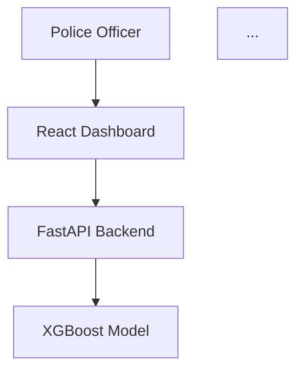

# 🤖 Claude AI Prompts for Advanced Documentation & Diagrams

## 📋 Table of Contents
1. [High-Level Design (HLD) Prompts](#high-level-design-hld-prompts)
2. [Low-Level Design (LLD) Prompts](#low-level-design-lld-prompts)
3. [UI/UX Workflow Prompts](#uiux-workflow-prompts)
4. [Architecture Diagram Prompts](#architecture-diagram-prompts)
5. [Database Design Prompts](#database-design-prompts)
6. [API Documentation Prompts](#api-documentation-prompts)
7. [Security Analysis Prompts](#security-analysis-prompts)
8. [Performance Optimization Prompts](#performance-optimization-prompts)
9. [Mermaid Diagram Prompts](#mermaid-diagram-prompts)
10. [ASCII Art Diagram Prompts](#ascii-art-diagram-prompts)

---

## 🏗️ High-Level Design (HLD) Prompts

### **System Architecture HLD**
```
I need you to create a comprehensive High-Level Design document for a Police Financial Crime Investigation System. Please analyze the following system details and provide a detailed HLD:

SYSTEM CONTEXT:
- AI-powered fraud detection platform for police investigations
- Real-time banking API integration with major Indian banks (SBI, HDFC, ICICI, Axis, PNB)
- Police-themed React dashboard for investigations
- FastAPI backend with XGBoost ML model achieving 99.96% AUC
- Real-time transaction monitoring and fraud pattern detection

ARCHITECTURE REQUIREMENTS:
- Frontend: React 18+ with Material-UI police dashboard
- Backend: FastAPI application with ML inference engine
- ML Model: XGBoost classifier with advanced feature engineering
- Banking Integration: Real-time API connections with OAuth authentication
- Analytics: Advanced financial crime analytics with 5 specialized modules
- Performance: Handle 1000+ transactions per minute with <2 second fraud detection

Please create a detailed HLD document including:
1. System component overview and relationships
2. High-level data flow architecture
3. Integration patterns and external dependencies
4. Scalability and performance considerations
5. Security framework and compliance requirements
6. Technology stack justification
7. Deployment architecture recommendations

Format the response as a professional technical document with clear sections and subsections.
```

### **Police Workflow HLD**
```
Please design a comprehensive high-level police investigation workflow for the fraud detection system. I need a detailed process flow that shows how police officers will use this AI system for financial crime investigations.

INVESTIGATION WORKFLOW CONTEXT:
The system serves police departments investigating financial fraud cases with AI-powered analysis and real-time banking data integration.

WORKFLOW STAGES TO DESIGN:
1. Case Initiation Process:
   - How complaints are received and processed
   - Initial data gathering procedures
   - Case number assignment and categorization
   - Priority level determination criteria

2. Investigation Setup:
   - Officer assignment and role definition
   - Banking API connection establishment
   - Real-time monitoring configuration
   - Evidence collection framework setup

3. Data Analysis Phase:
   - Transaction data upload and validation
   - AI-powered fraud detection execution
   - Pattern analysis and risk assessment
   - Suspicious activity identification

4. Active Investigation:
   - Suspect identification and tracking
   - Asset investigation and freezing procedures
   - Inter-agency coordination protocols
   - Evidence compilation and documentation

5. Case Resolution:
   - Court evidence preparation
   - Final investigation reports
   - Case closure procedures
   - Knowledge base updates for future cases

Please provide:
- Detailed process flow diagrams (describe visually)
- Decision points and escalation criteria
- Integration touchpoints with the AI system
- Timeline considerations and SLA requirements
- Resource allocation and workload distribution
- Quality assurance and review processes

Format as a comprehensive workflow document suitable for police department SOPs.
```

---

## 🔧 Low-Level Design (LLD) Prompts

### **API Endpoint Design**
```
I need you to create a comprehensive Low-Level Design document for all FastAPI endpoints in the fraud detection system. Please analyze the existing system and provide detailed technical specifications.

SYSTEM CONTEXT:
- FastAPI backend serving a police fraud detection system
- XGBoost ML model for real-time fraud analysis
- Banking API integrations for live transaction monitoring
- Police dashboard requiring detailed API responses

CORE ENDPOINTS TO DESIGN:
1. POST /predict - Single transaction fraud analysis
2. POST /upload - Batch CSV file processing
3. GET /banking/status - Banking system connectivity
4. GET /banking/transactions/{bank} - Live transaction feeds
5. POST /analytics/comprehensive - Advanced analytics suite

For each endpoint, please provide:
1. Detailed request/response schemas with Python type hints
2. Pydantic model definitions with validation rules
3. Authentication and authorization requirements
4. Error handling patterns and HTTP status codes
5. Performance considerations and async patterns
6. Database interaction patterns
7. External API integration handling
8. Rate limiting and security measures

Example format for one endpoint:
```python
@app.post("/predict", response_model=PredictionResponse)
async def predict_transaction(
    data: TransactionRequest,
    current_user: User = Depends(get_current_user)
) -> PredictionResponse:
    # Detailed implementation specs
```

Please include sequence diagrams (described textually) showing the complete request-response flow for complex endpoints.

Format as a technical specification document suitable for development implementation.
```

### **ML Model Pipeline LLD**
```
Design the low-level architecture for the XGBoost fraud detection pipeline:

PIPELINE COMPONENTS:
1. Data Preprocessing:
   - Input validation and sanitization
   - Feature engineering pipeline
   - Data transformation steps
   - Missing value handling

2. Model Inference:
   - Model loading and caching
   - Batch vs real-time processing
   - Feature scaling and encoding
   - Prediction generation

3. Result Processing:
   - Probability interpretation
   - Risk level calculation
   - Confidence scoring
   - Alert generation logic

4. Performance Optimization:
   - Model caching strategies
   - Batch processing optimization
   - Memory management
   - CPU/GPU utilization

TECHNICAL DETAILS:
- File structure and model artifacts
- Loading and initialization procedures
- Thread safety considerations
- Error handling and fallback mechanisms
- Performance metrics and monitoring
- Model versioning and updates

Please include:
- Class diagrams for model components
- Data flow through the pipeline
- Error handling strategies
- Performance benchmarks
- Scalability considerations
```

### **Banking Integration LLD**
```
Create detailed low-level design for the Indian banking API integration module:

INTEGRATION ARCHITECTURE:
1. Authentication Management:
   - OAuth 2.0 flow implementation
   - API key management
   - Certificate-based authentication
   - Token refresh mechanisms

2. API Communication:
   - HTTP client configuration
   - Request/response handling
   - Retry logic and exponential backoff
   - Connection pooling and management

3. Data Processing:
   - Real-time transaction parsing
   - Data format standardization
   - Error detection and correction
   - Fraud pattern recognition

4. Alert System:
   - Real-time monitoring setup
   - Threshold-based alerting
   - Multi-channel notifications
   - Alert escalation procedures

BANK-SPECIFIC IMPLEMENTATIONS:
- SBI API integration details
- HDFC authentication flow
- ICICI data format specifications
- Axis Bank error handling
- PNB real-time monitoring

Include:
- Class hierarchy and interfaces
- State management patterns
- Error handling matrices
- Performance optimization techniques
- Security implementation details
```

---

## 🎨 UI/UX Workflow Prompts

### **Police Dashboard UI Design**
```
Create comprehensive UI/UX design specifications for the police fraud investigation dashboard:

DASHBOARD COMPONENTS:
1. Header Section:
   - Police department branding
   - Officer identification and role
   - System status indicators
   - Quick action buttons

2. Main Dashboard:
   - Real-time alert panel
   - Active case summary
   - Investigation progress tracker
   - System health monitors

3. Investigation Workspace:
   - Case file management
   - Data upload interface
   - Analysis results display
   - Evidence collection tools

4. Monitoring Center:
   - Live transaction feeds
   - Banking system status
   - Fraud pattern alerts
   - Geographic activity map

UI/UX REQUIREMENTS:
- Police-themed color scheme (blues, badges, official styling)
- Intuitive workflow for non-technical officers
- Mobile-responsive design for field use
- Accessibility compliance (WCAG 2.1)
- High-contrast mode for 24/7 operations

Please provide:
- Wireframe layouts for all screens
- Component interaction flows
- User journey mapping
- Error state designs
- Loading and progress indicators
- Responsive breakpoint specifications
```

### **Investigation Workflow UI**
```
Design the complete user interface workflow for police fraud investigations:

WORKFLOW SCREENS:
1. Case Creation:
   - Complaint intake form
   - Initial case assessment
   - Priority level assignment
   - Resource allocation

2. Data Input:
   - CSV file upload with validation
   - Manual transaction entry
   - Banking data import
   - Evidence attachment system

3. Analysis Dashboard:
   - AI analysis progress display
   - Real-time results updates
   - Risk assessment visualization
   - Pattern detection highlights

4. Investigation Tools:
   - Suspect profile builder
   - Timeline visualization
   - Network analysis display
   - Evidence correlation matrix

5. Reporting System:
   - Investigation summary generation
   - Court-ready evidence compilation
   - Case closure documentation
   - Knowledge base updates

INTERACTION PATTERNS:
- Progressive disclosure of complex information
- Context-sensitive help and guidance
- Bulk operations for efficiency
- Undo/redo functionality
- Auto-save for data protection

Include detailed mockups and interaction specifications.
```

---

## 📊 Architecture Diagram Prompts

### **System Component Diagram**
```
Generate a detailed system architecture diagram showing all components and their interactions:

COMPONENT LAYERS:
1. Presentation Layer:
   - React Frontend (Port 3000)
   - Police Dashboard Interface
   - Mobile-responsive components
   - Real-time update mechanisms

2. Application Layer:
   - FastAPI Backend (Port 8001)
   - Authentication and authorization
   - Business logic processing
   - API gateway functionality

3. Service Layer:
   - ML Model Service (XGBoost)
   - Banking Integration Service
   - Analytics Engine Service
   - Alert and Notification Service

4. Data Layer:
   - Model artifacts (PKL files)
   - Transaction data streams
   - Configuration storage
   - Audit and logging data

5. External Integrations:
   - Banking APIs (SBI, HDFC, ICICI, Axis, PNB)
   - Authentication providers
   - Notification services
   - Monitoring systems

DIAGRAM REQUIREMENTS:
- Show data flow directions
- Indicate protocols (HTTP, WebSocket, API)
- Mark security boundaries
- Highlight failure points
- Include load balancing points
- Show caching layers

Use ASCII art or provide detailed descriptions for visual representation.
```

### **Data Flow Architecture**
```
Create comprehensive data flow diagrams for the fraud detection system:

PRIMARY DATA FLOWS:
1. Investigation Workflow:
   Police Input → Validation → AI Analysis → Results → Action

2. Real-time Monitoring:
   Banking APIs → Data Aggregation → Fraud Detection → Alerts → Police Dashboard

3. Batch Processing:
   CSV Upload → Data Processing → ML Inference → Risk Assessment → Investigation Report

4. Analytics Pipeline:
   Transaction Data → Feature Engineering → Pattern Analysis → Insights → Recommendations

DATA TRANSFORMATION STAGES:
- Raw transaction data ingestion
- Data cleaning and validation
- Feature engineering and encoding
- ML model preprocessing
- Prediction and scoring
- Risk assessment calculation
- Alert generation and routing
- Report compilation and delivery

INTEGRATION POINTS:
- Banking API data ingestion
- Real-time stream processing
- Batch job scheduling
- Alert notification delivery
- Evidence storage and retrieval

Please include:
- Data format specifications at each stage
- Processing time requirements
- Error handling and recovery paths
- Data quality checkpoints
- Performance monitoring points
```

---

## 🗃️ Database Design Prompts

### **Data Model Design**
```
Design the complete data model for the fraud detection system:

CORE ENTITIES:
1. Investigation Cases:
   - Case ID, officer assignment, priority level
   - Creation timestamp, status updates
   - Related transactions and evidence
   - Investigation notes and outcomes

2. Transaction Records:
   - Transaction ID, amount, timestamp
   - Payment method, merchant category
   - Customer information, device data
   - Fraud probability and risk scores

3. Banking Connections:
   - Bank codes, API configurations
   - Authentication credentials
   - Connection status and health
   - Rate limiting and quota tracking

4. Analysis Results:
   - Analysis type and parameters
   - Results data and visualizations
   - Confidence scores and recommendations
   - Historical trend comparisons

5. Alert Records:
   - Alert type, severity level, timestamp
   - Associated transactions and patterns
   - Officer assignments and responses
   - Resolution status and outcomes

6. Audit Logs:
   - User actions and system events
   - Data access and modifications
   - Security events and violations
   - Performance metrics and errors

DATA RELATIONSHIPS:
- One-to-many: Cases to Transactions
- Many-to-many: Officers to Cases
- One-to-many: Banks to Connections
- One-to-many: Transactions to Alerts

Please provide:
- Entity relationship diagrams
- Table schemas with constraints
- Index optimization strategies
- Data retention policies
- Backup and recovery procedures
```

### **File Storage Architecture**
```
Design the file storage and management system for ML models and data:

STORAGE COMPONENTS:
1. ML Model Artifacts:
   - XGBoost model files (PKL format)
   - Feature encoders and scalers
   - Model metadata and versioning
   - Performance benchmarks

2. Training Data:
   - Historical transaction datasets
   - Labeled fraud examples
   - Feature engineering pipelines
   - Data quality reports

3. Investigation Files:
   - Uploaded CSV files
   - Generated reports and evidence
   - Case documentation
   - Exported analysis results

4. System Configuration:
   - API keys and certificates
   - Banking connection settings
   - Alert thresholds and rules
   - User permissions and roles

STORAGE REQUIREMENTS:
- High availability and durability
- Encryption at rest and in transit
- Version control and rollback
- Automated backup procedures
- Access control and auditing

Include storage architecture diagrams and access patterns.
```

---

## 📋 API Documentation Prompts

### **OpenAPI Specification**
```
Please generate a comprehensive OpenAPI (Swagger) specification document for the Police Financial Crime Investigation System API.

SYSTEM CONTEXT:
- FastAPI backend with fraud detection capabilities
- Police-focused endpoints for investigation workflows
- Banking integration APIs for real-time monitoring
- ML model inference endpoints for fraud analysis

API DOCUMENTATION REQUIREMENTS:
1. Complete OpenAPI 3.0 specification in YAML format
2. Detailed endpoint descriptions with use cases
3. Comprehensive request/response schemas
4. Authentication and security definitions
5. Example requests and responses
6. Error response documentation
7. Rate limiting and usage guidelines

ENDPOINTS TO DOCUMENT:
- Authentication: /login, /logout, /refresh
- Fraud Detection: /predict, /batch-analyze
- File Operations: /upload, /download-report
- Banking Integration: /banking/status, /banking/transactions
- Analytics: /analytics/comprehensive, /analytics/patterns
- Investigation: /cases, /evidence, /reports

Please include:
1. API metadata (title, description, version, contact)
2. Server configurations and base URLs
3. Security schemes (JWT, API keys)
4. Data models with validation rules
5. Response codes and error handling
6. Usage examples and code samples

Format as a complete OpenAPI specification that can be imported into Swagger UI or Postman for API testing and documentation.

Example structure:
```yaml
openapi: 3.0.0
info:
  title: Police Fraud Detection API
  description: AI-powered fraud detection system for police investigations
  version: 1.0.0
paths:
  /predict:
    post:
      summary: Analyze transaction for fraud
      # detailed specification
```

Make it production-ready and comprehensive for developer integration.
```

### **SDK and Integration Guide**
```
Create developer integration guides and SDK documentation:

INTEGRATION COMPONENTS:
1. Python SDK:
   - Client library installation
   - Authentication setup
   - Method implementations
   - Error handling examples

2. JavaScript/React Integration:
   - Frontend integration patterns
   - API call implementations
   - State management strategies
   - Error boundary handling

3. Webhook Integration:
   - Alert notification setup
   - Payload specifications
   - Security validation
   - Retry mechanisms

4. Banking API Integration:
   - Bank-specific authentication
   - Data format conversions
   - Error handling strategies
   - Rate limiting compliance

EXAMPLES AND TUTORIALS:
- Quick start guide
- Common use case implementations
- Best practices and patterns
- Troubleshooting guide
- Performance optimization tips

Please provide:
- Code examples in multiple languages
- Step-by-step integration tutorials
- Configuration templates
- Testing procedures
- Deployment guidelines
```

---

## 🔒 Security Analysis Prompts

### **Security Architecture Review**
```
Conduct comprehensive security analysis for the fraud detection system:

SECURITY DOMAINS:
1. Authentication & Authorization:
   - Multi-factor authentication implementation
   - Role-based access control (RBAC)
   - Session management and timeout
   - Password policies and encryption

2. Data Protection:
   - Encryption at rest and in transit
   - PII data handling and anonymization
   - GDPR compliance requirements
   - Data retention and purging policies

3. API Security:
   - Input validation and sanitization
   - SQL injection prevention
   - Cross-site scripting (XSS) protection
   - Rate limiting and DDoS protection

4. Banking Integration Security:
   - Secure API key management
   - Certificate-based authentication
   - Data transmission encryption
   - Audit logging and monitoring

5. Infrastructure Security:
   - Network segmentation and firewalls
   - Container security practices
   - Secrets management
   - Vulnerability scanning and patching

THREAT MODELING:
- Identify potential attack vectors
- Risk assessment and mitigation strategies
- Security controls implementation
- Incident response procedures
- Compliance requirements (PCI DSS, SOX)

Please provide:
- Security architecture diagrams
- Threat analysis matrices
- Control implementation guidelines
- Compliance checklists
- Incident response playbooks
```

---

## ⚡ Performance Optimization Prompts

### **Performance Analysis and Optimization**
```
Analyze and optimize performance across the fraud detection system:

PERFORMANCE DOMAINS:
1. API Response Times:
   - Endpoint latency measurements
   - Database query optimization
   - Caching strategies implementation
   - Async processing patterns

2. ML Model Performance:
   - Inference time optimization
   - Batch processing efficiency
   - Memory usage optimization
   - GPU acceleration opportunities

3. Real-time Processing:
   - Stream processing optimization
   - Event-driven architecture
   - Message queue performance
   - Alert delivery latency

4. Frontend Performance:
   - React component optimization
   - Bundle size reduction
   - Lazy loading implementation
   - Progressive web app features

5. Banking Integration Performance:
   - API call optimization
   - Connection pooling strategies
   - Retry logic efficiency
   - Data synchronization patterns

OPTIMIZATION STRATEGIES:
- Identify performance bottlenecks
- Implement caching layers
- Optimize database queries
- Scale horizontally and vertically
- Monitor and alert on performance metrics

BENCHMARKING REQUIREMENTS:
- Response time targets (<2 seconds)
- Throughput requirements (1000+ TPS)
- Resource utilization limits
- Scalability testing procedures
- Performance regression testing

Please provide:
- Performance testing strategies
- Optimization implementation plans
- Monitoring and alerting setup
- Scalability architecture recommendations
- Resource planning guidelines
```

---

## 🚀 Deployment and DevOps Prompts

### **CI/CD Pipeline Design**
```
Design comprehensive CI/CD pipeline for the fraud detection system:

PIPELINE STAGES:
1. Source Control:
   - Git workflow and branching strategy
   - Code review and approval processes
   - Automated code quality checks
   - Security vulnerability scanning

2. Build and Test:
   - Automated testing suites
   - Code coverage requirements
   - Integration testing procedures
   - Performance testing validation

3. Security and Compliance:
   - Security scanning integration
   - Compliance validation checks
   - Dependency vulnerability assessment
   - License compliance verification

4. Deployment Automation:
   - Environment provisioning
   - Blue-green deployment strategy
   - Database migration procedures
   - Configuration management

5. Monitoring and Validation:
   - Health check implementations
   - Performance monitoring setup
   - Alert configuration
   - Rollback procedures

TOOLS AND TECHNOLOGIES:
- GitHub Actions or Jenkins
- Docker containerization
- Kubernetes orchestration
- Terraform infrastructure as code
- Monitoring and logging solutions

Please provide:
- Pipeline configuration files
- Deployment automation scripts
- Environment setup procedures
- Monitoring and alerting configuration
- Disaster recovery procedures
```

---

## 📈 Analytics and Reporting Prompts

### **Business Intelligence Dashboard**
```
Design comprehensive analytics and reporting system for fraud investigation insights:

ANALYTICS COMPONENTS:
1. Investigation Metrics:
   - Case resolution times and success rates
   - Officer productivity and workload distribution
   - Fraud detection accuracy and false positive rates
   - Cost savings and impact measurements

2. Fraud Pattern Analysis:
   - Trending fraud types and techniques
   - Geographic and temporal patterns
   - Risk assessment accuracy tracking
   - Predictive model performance metrics

3. System Performance Analytics:
   - API response times and throughput
   - Banking integration health and availability
   - User activity and engagement patterns
   - Resource utilization and capacity planning

4. Compliance Reporting:
   - Audit trail and access logs
   - Data retention and privacy compliance
   - Security incident tracking and response
   - Regulatory reporting requirements

VISUALIZATION REQUIREMENTS:
- Real-time dashboards for operations
- Historical trend analysis
- Interactive data exploration
- Automated report generation
- Mobile-optimized viewing

Please provide:
- Dashboard mockups and layouts
- Data aggregation strategies
- Visualization component specifications
- Report generation procedures
- Export and sharing mechanisms
```

---

---

## 🎨 Mermaid Diagram Prompts

### **System Architecture Mermaid Diagram**
```
Please create a Mermaid diagram showing the complete system architecture for the Police Financial Crime Investigation System. 

SYSTEM COMPONENTS TO INCLUDE:
- React Frontend (Police Dashboard) on port 3000
- FastAPI Backend with ML engine on port 8001
- XGBoost fraud detection model (99.96% AUC)
- Banking API integrations (SBI, HDFC, ICICI, Axis, PNB)
- Advanced analytics engine with 5 modules
- Real-time monitoring and alert systems

Please create a Mermaid flowchart diagram that shows:
1. User interactions and data flow
2. Component relationships and dependencies
3. External API integrations
4. Data processing pipelines
5. Real-time monitoring flows

Use Mermaid syntax with proper node types (rectangles, circles, diamonds) and connection arrows with labels. Include color coding for different system layers (frontend, backend, data, external).

Example format:


Make it comprehensive and visually clear for technical documentation.
```

### **Police Investigation Workflow Mermaid**
```
Create a detailed Mermaid flowchart showing the complete police investigation workflow using the fraud detection system.

WORKFLOW TO DIAGRAM:
1. Case initiation and setup
2. Data upload and validation
3. AI analysis and fraud detection
4. Investigation procedures
5. Evidence collection and documentation
6. Case resolution and reporting

Please create a Mermaid flowchart that includes:
- Decision points (diamond shapes)
- Process steps (rectangles)
- Start/end points (circles)
- Conditional flows and branches
- Integration points with the AI system
- Escalation and approval processes

Use different colors to represent:
- Officer actions (blue)
- System processes (green)
- Decision points (yellow)
- External integrations (red)

Include timing information and SLA requirements where relevant.

Format as a comprehensive Mermaid diagram suitable for police department documentation.
```

### **Banking Integration Flow Mermaid**
```
Please create a Mermaid sequence diagram showing the real-time banking integration flow for fraud detection.

INTEGRATION FLOW TO SHOW:
1. Authentication with banking APIs
2. Real-time transaction data retrieval
3. Fraud detection processing
4. Alert generation and notification
5. Investigation workflow initiation

Banks to include: SBI, HDFC, ICICI, Axis Bank, PNB

Please create a Mermaid sequence diagram showing:
- Authentication flows (OAuth 2.0, API keys)
- Data retrieval and processing
- Real-time monitoring setup
- Fraud pattern detection
- Alert generation and routing
- Error handling and retry mechanisms

Use proper sequence diagram syntax with actors, participants, and message flows. Include timing information and asynchronous operations.

Example format:
```mermaid
sequenceDiagram
    participant P as Police System
    participant B as Banking API
    participant M as ML Model
    P->>B: Authenticate
    B->>P: Access Token
    ...
```

Make it detailed enough for technical implementation reference.
```

---

## 🎭 ASCII Art Diagram Prompts

### **System Architecture ASCII Diagram**
```
Please create a detailed ASCII art diagram showing the complete system architecture for the Police Financial Crime Investigation System.

COMPONENTS TO VISUALIZE:
- Frontend: React Police Dashboard (Port 3000)
- Backend: FastAPI with ML Engine (Port 8001)
- ML Model: XGBoost Classifier (99.96% AUC)
- Banking APIs: SBI, HDFC, ICICI, Axis, PNB
- Analytics Engine: 5 specialized modules
- Data Flow: Real-time and batch processing

Create an ASCII diagram that shows:
1. System layers and boundaries
2. Data flow directions with arrows
3. Component relationships
4. External integrations
5. Load balancing and scaling points

Use ASCII characters like:
- Boxes: ┌─┐ │ │ └─┘
- Arrows: ──>, <──, ↕, ↔
- Connections: ├, ┤, ┬, ┴, ┼
- Boundaries: ═══, |||, +++

Example partial structure:
```
┌─────────────────┐    ┌─────────────────┐
│  React Frontend │<-->│  FastAPI Backend│
│   (Port 3000)   │    │   (Port 8001)   │
└─────────────────┘    └─────────────────┘
```

Make it comprehensive and technically accurate for documentation purposes.
```

### **Investigation Workflow ASCII**
```
Create a detailed ASCII flowchart showing the police investigation workflow using the fraud detection system.

WORKFLOW STAGES:
1. Case Creation → Data Upload → AI Analysis → Investigation → Resolution

Please create an ASCII flowchart using:
- Boxes for processes: [Process Name]
- Diamonds for decisions: <Decision?>
- Arrows for flow: -->, <--, |, v, ^
- Branches for conditions: ├─, ─┤, ┬─, ─┴

Include:
- Officer actions and system processes
- Decision points and branching logic
- Time estimates for each stage
- Integration points with AI system
- Escalation and approval flows
- Error handling and recovery paths

Example structure:
```
[Case Created] --> <Valid Data?> --> [AI Analysis]
      |              |   No              |
      v              v                   v
[Data Upload]   [Error Handling]   [Fraud Detection]
```

Make it detailed enough to serve as a process reference guide.
```

### **Data Flow ASCII Architecture**
```
Please create a comprehensive ASCII diagram showing data flow through the fraud detection system.

DATA FLOWS TO SHOW:
1. Real-time banking data ingestion
2. Batch CSV file processing
3. ML model inference pipeline
4. Analytics and reporting flows
5. Alert and notification delivery

Create an ASCII data flow diagram showing:
- Data sources and destinations
- Processing stages and transformations
- Storage and caching layers
- Real-time vs batch processing paths
- Error handling and recovery flows

Use ASCII elements:
- Data stores: [=====]
- Processes: (Process)
- External systems: {{External}}
- Queues: <Queue>
- Flows: ===>, <===, |||

Example partial flow:
```
{{Banking APIs}} ===> <Transaction Queue> ===> (Fraud Detection) ===> [Alert System]
       |                    |                       |                      |
       v                    v                       v                      v
   [Raw Data]          [Processed Data]        [ML Results]          [Notifications]
```

Include timing, volume, and performance characteristics for each flow.
```

---

These Claude AI prompts provide comprehensive coverage for generating all technical documentation, diagrams, and analysis needed for the fraud detection system. Each prompt is specifically designed for Claude's capabilities in creating detailed documentation, Mermaid diagrams, and ASCII art visualizations.
